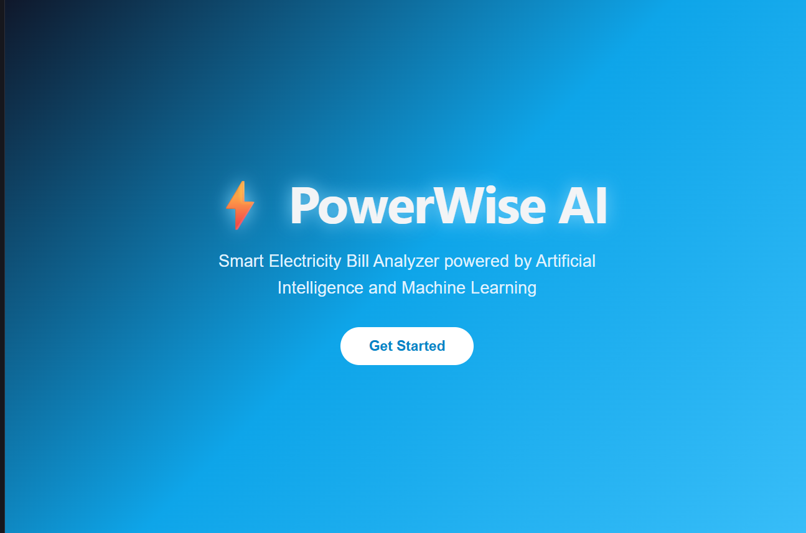
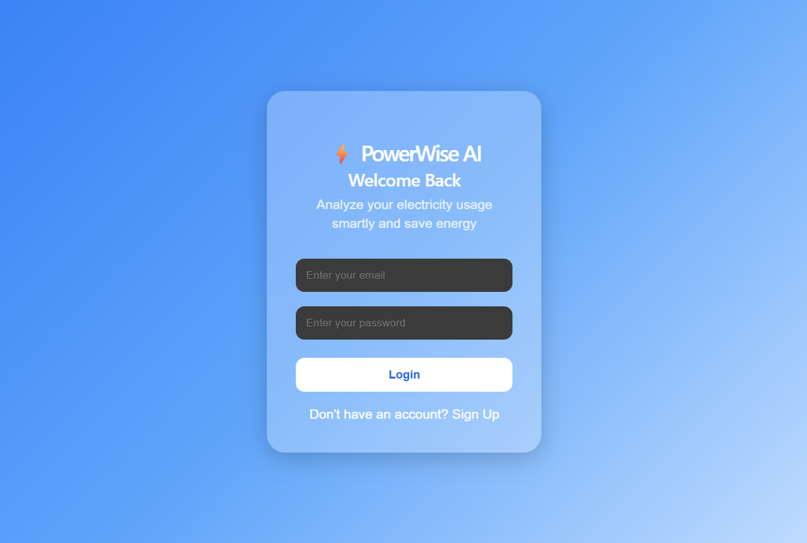
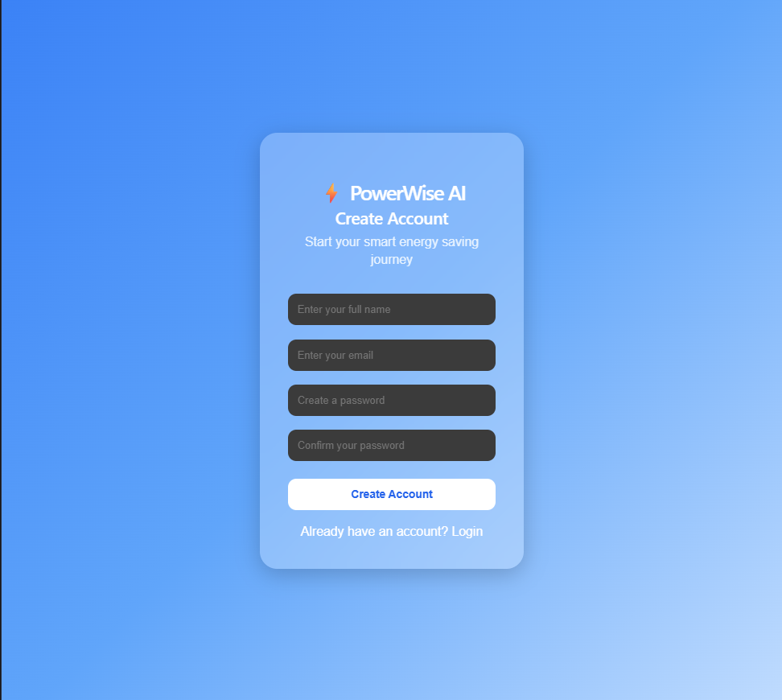
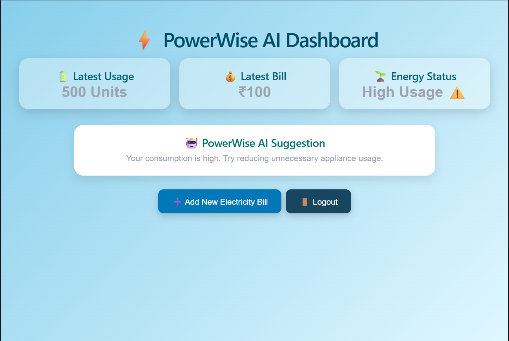
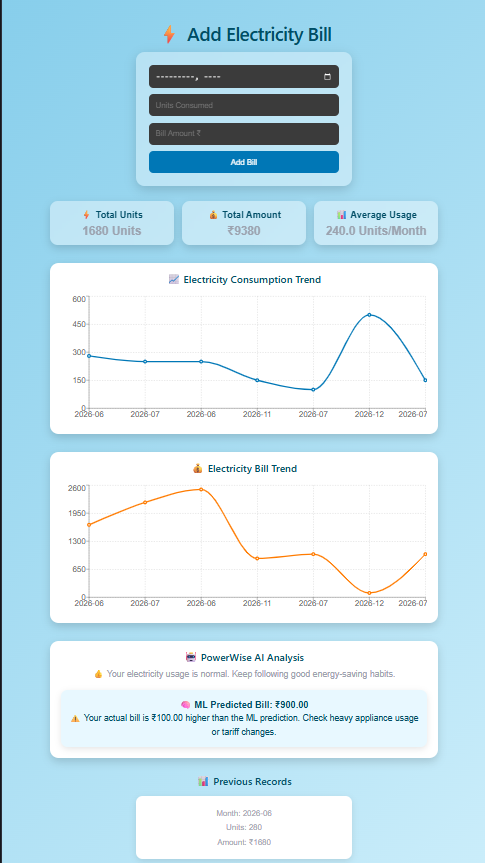

# ⚡ PowerWise AI - Smart Electricity Bill Analyzer

## About the Project

PowerWise AI is a full-stack web application that I developed to help users understand and manage their electricity consumption. The application allows users to add their monthly electricity bills, view usage trends, and get a predicted bill amount using a Machine Learning model.

This project combines a React frontend, a Flask-based Python backend, and a Machine Learning model to provide useful insights for electricity consumption and energy management.

---

## Features

- Add and manage monthly electricity bill records
- Visualize electricity usage and bill trends using interactive charts
- Predict electricity bills using a Machine Learning model
- Compare actual bills with AI predicted bills
- Get smart energy-saving insights based on consumption patterns
- View previous electricity records in a simple dashboard
- Responsive user interface with smooth animations

---

## Technologies Used

### Frontend

- React.js
- Vite
- JavaScript
- CSS
- Axios
- Framer Motion
- Recharts

### Backend

- Python
- Flask
- Flask-CORS

### Machine Learning

- Scikit-learn
- Linear Regression

---

## How It Works

User enters electricity bill details  
↓  
React frontend sends the data to the Flask API  
↓  
Flask backend processes the request and sends data to the Machine Learning model  
↓  
The model predicts the expected electricity bill  
↓  
PowerWise AI compares the actual and predicted bill and provides insights

---

## Challenges I Faced

One of the major challenges I faced was connecting the frontend and backend after deployment. I solved it by configuring API communication properly using environment variables and ensuring smooth connection between Vercel and Render.

---

## Project Links

### Live Application

Frontend:
https://power-wise-ai-six.vercel.app/

Backend API:
https://powerwise-ai-backend.onrender.com

### GitHub Repository

https://github.com/doddaboinasusmitha/PowerWise-AI

---

## 📸 Project Screenshots

### 🏠 Welcome Page



### 🔐 Login Page



### 📝 Signup Page



### ⚡ Dashboard



### 🤖 ML Prediction Result



## Installation and Setup

### Clone the Repository

```bash
git clone https://github.com/doddaboinasusmitha/PowerWise-AI.git
```

### Frontend Setup

```bash
npm install
npm run dev
```

### Backend Setup

```bash
cd backend
pip install -r requirements.txt
python app.py
```

---

## Future Improvements

- Add user authentication and personalized accounts
- Integrate a cloud database for storing electricity records
- Improve the ML model with more training data
- Add more advanced AI-based energy-saving recommendations

---

## Developer

Developed by **Susmitha**  
B.Tech AIML Student (Artificial Intelligence & Machine Learning)

---

Thank you for visiting my project. I built PowerWise AI to apply my knowledge of AI, Machine Learning, and full-stack development to solve a real-world problem.
